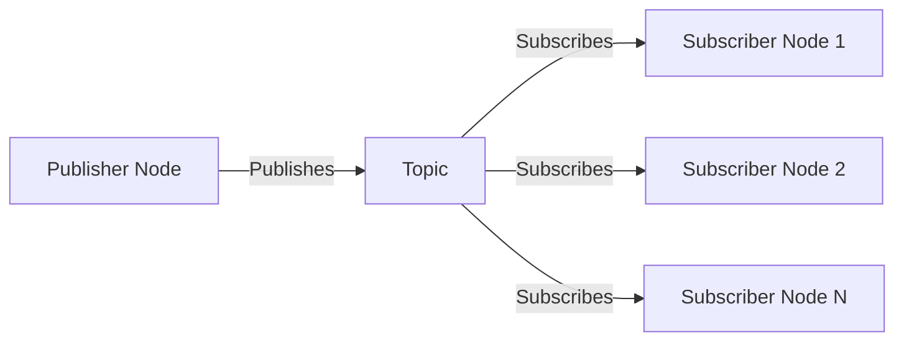
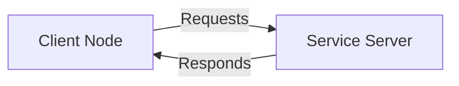

# Understanding ROS 2 Architecture

## Overview

The ROS 2 architecture forms the backbone of modern robotic systems. Understanding this architecture is crucial for building robust, scalable, and maintainable robotic applications. In this chapter, we'll explore the fundamental building blocks that make ROS 2 a powerful framework for robotics development.

## The ROS 2 Ecosystem

ROS 2 follows a distributed computing model where different components of a robot system communicate through a well-defined middleware. This architecture enables:

- **Modularity**: Components can be developed and tested independently
- **Scalability**: Systems can span multiple machines and networks
- **Language Agnostic**: Nodes can be written in different programming languages
- **Fault Tolerance**: Individual node failures don't bring down the entire system

## Core Architecture Components

### 1. Nodes

A **Node** is the fundamental unit of computation in ROS 2. Think of it as a process that performs a specific task.

**Key characteristics:**
- Each node has a unique name within the ROS 2 domain
- Nodes can publish to topics, subscribe to topics, provide services, or use services
- Multiple nodes can run on the same machine or across a network
- Nodes are managed by the ROS 2 runtime system

**Example nodes in a mobile robot:**
- Sensor driver nodes (camera, LIDAR, IMU)
- Navigation node
- Path planning node
- Motor control node
- Perception node

### 2. Topics and Message Passing

**Topics** enable asynchronous communication through a publish-subscribe pattern. This decoupled communication allows for flexible system design.

**How it works:**
1. A node publishes messages to a topic
2. Any number of nodes can subscribe to that topic
3. Messages are delivered to all subscribers
4. Publishers and subscribers are decoupled in time and space

**Key concepts:**
- **Message Types**: Define the structure of data exchanged
- **Quality of Service (QoS)**: Control delivery guarantees
- **Topic Names**: Follow a naming convention for organization

### 3. Services

**Services** provide synchronous request-response communication. They're ideal for operations that require immediate responses.

**Service characteristics:**
- Request-response pattern
- Synchronous communication
- One service server, one client at a time
- Request and response message types

**Example services:**
- Map saving/loading
- Robot calibration
- Navigation goal setting

### 4. Actions

**Actions** are an extension of services for long-running tasks with feedback.

**Action components:**
- Goal: Request for a long-running task
- Feedback: Periodic updates during execution
- Result: Final outcome of the task

## Communication Patterns

### Publisher-Subscriber Pattern


### Client-Service Pattern


## Quality of Service (QoS) Settings

QoS settings allow you to control communication behavior:

- **Reliability**: Best effort vs. reliable delivery
- **Durability**: Transient local vs. volatile
- **History**: Keep last N messages vs. keep all
- **Depth**: Size of message queue

## Practical Example: Simple Robot Architecture

Let's consider a simple mobile robot architecture:

```
┌─────────────────┐    ┌──────────────────┐    ┌─────────────────┐
│   Navigation    │    │   Sensor Fusion  │    │   Motor Control │
│     Node        │◄──►│      Node        │◄──►│     Node        │
└─────────────────┘    └──────────────────┘    └─────────────────┘
         ▲                       ▲                       ▲
         │                       │                       │
         └───────────────────────┼───────────────────────┘
                                 │
                    ┌──────────────────┐
                    │   Sensor Data    │
                    │     Topics       │
                    └──────────────────┘
```

**Communication flow:**
1. Sensor nodes publish data (LIDAR, camera, IMU) to topics
2. Sensor fusion node subscribes to multiple sensor topics
3. Navigation node subscribes to processed sensor data
4. Navigation node publishes motor commands to topics
5. Motor control node subscribes to motor commands and controls hardware

## Namespaces and Naming Conventions

### Namespaces
Namespaces help organize nodes and topics:
- `/robot1/sensors/lidar` - LIDAR on robot 1
- `/robot2/sensors/lidar` - LIDAR on robot 2

### Naming Conventions
- Use lowercase with underscores: `sensor_data`, `motor_commands`
- Be descriptive but concise
- Use hierarchical structure when appropriate

## Middleware Implementation

ROS 2 uses DDS (Data Distribution Service) as its underlying middleware. This provides:

- **Discovery**: Automatic detection of nodes and topics
- **Communication**: Reliable message delivery
- **Configuration**: QoS settings and policies
- **Security**: Authentication and encryption capabilities

## Hands-On Exercise: Exploring the Architecture

Let's explore the ROS 2 architecture using command-line tools:

### 1. Check available nodes
```bash
ros2 node list
```

### 2. Check available topics
```bash
ros2 topic list
```

### 3. Examine a topic
```bash
ros2 topic info /topic_name
```

### 4. Echo topic messages
```bash
ros2 topic echo /topic_name
```

### 5. Check available services
```bash
ros2 service list
```

## Common Architecture Patterns

### 1. Sensor Processing Pipeline
```
Raw Sensor Data → Filtering → Processing → Feature Extraction
```

### 2. Control Loop Architecture
```
Perception → Planning → Control → Actuation → Feedback
```

### 3. Distributed Processing
```
Local Processing → Cloud Services → Edge Computing
```

## Best Practices

### Design Principles
1. **Single Responsibility**: Each node should have one clear purpose
2. **Loose Coupling**: Minimize dependencies between nodes
3. **High Cohesion**: Group related functionality within nodes
4. **Clear Interfaces**: Well-defined topics and services

### Performance Considerations
- Minimize message size for high-frequency topics
- Use appropriate QoS settings for different use cases
- Consider data compression for large messages
- Implement proper error handling and recovery

## Summary

Understanding ROS 2 architecture is fundamental to building effective robotic systems. The node-topic-service architecture provides a flexible, scalable foundation for complex robot applications. By following best practices and understanding communication patterns, you can design robust systems that are easy to maintain and extend.

## Next Steps

Now that you understand the architecture, continue to [Creating Your First ROS 2 Node](./first-node.md) to implement your first node and see these concepts in action.